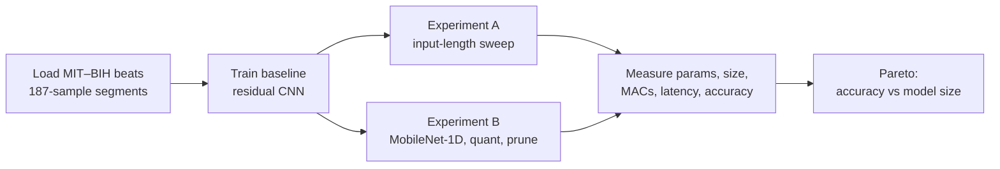

<div align="center">

# ECG Heartbeat Classification

**Efficient five-class arrhythmia classification for wearables — reproducing a residual-CNN beat classifier on MIT–BIH, then squeezing it down with input-length reduction, a depthwise-separable architecture, quantization, and pruning.**


</div>

---

## Overview

This project builds an efficient ECG heartbeat classifier aimed at wearable, resource-constrained deployment. It reproduces the five-class (AAMI EC57) arrhythmia classifier on the MIT–BIH dataset, building on the transferable residual-CNN representation of Kachuee et al. (2018), and then asks a practical question: **how small and fast can the model get without losing accuracy?**

To answer that, it compares four efficiency levers and reports parameters, on-disk size, MACs, latency, and accuracy for each:

- **Input-length reduction** — shrinking the per-beat window.
- **Depthwise-separable architecture** — a MobileNet-style 1-D CNN.
- **Post-training quantization** — TFLite dynamic-range and int8.
- **Magnitude pruning** — measured by compressed (gzip) size.

## How it works



### Notebook workflow

The single notebook runs end to end and reproduces every figure and table:

1. **Data loading** — reads the pre-segmented MIT–BIH CSVs (187-sample beats). If the CSVs are missing it falls back to clearly-labelled synthetic data so the notebook still runs; real data is required for the reported numbers.
2. **Experiment A — input-length sweep** — trains the baseline residual CNN at lengths `{187, 140, 96, 64, 48, 32}`, recording params, MACs, size, latency, and accuracy.
3. **Experiment B — efficiency levers** — a depthwise-separable `MobileNet-1D`, TFLite dynamic + int8 quantization (with a quantized-accuracy check), and magnitude pruning measured by gzip size.
4. **Pareto comparison** — accuracy versus model size across all variants.

## Repository structure

| Path | Role |
| --- | --- |
| `ecg_heartbeat_classification.ipynb` | End-to-end notebook: data loading, training, efficiency experiments, and plots. |
| `README.md` | This file. |

## Data

Download the **ECG Heartbeat Categorization Dataset** (processed MIT–BIH) from Kaggle and place `mitbih_train.csv` and `mitbih_test.csv` in the folder pointed to by `DATA_DIR` in the notebook's config cell. Underlying source: the PhysioNet MIT–BIH Arrhythmia Database (Moody & Mark, 2001; Goldberger et al., 2000).

## Getting started

### Requirements

```bash
pip install tensorflow numpy pandas matplotlib
```

Trains in minutes on a GPU (developed on an NVIDIA RTX 2080 Ti). For final numbers, set `EPOCHS ≈ 30` and `SUBSAMPLE_TRAIN = None` in the config cell.

### Run

```bash
jupyter notebook ecg_heartbeat_classification.ipynb   # run all cells top to bottom
```

## Results (real MIT–BIH)

| Model | Params | Size | Accuracy |
| --- | --- | --- | --- |
| Residual CNN (FP32, L=187) | 58,053 | 800.4 KB | 0.9863 |
| Residual CNN (int8) | 58,053 | 85.9 KB | ≈0.985 |
| MobileNet-1D (FP32) | 7,493 | — | 0.9758 |
| Residual CNN (L=32) | 52,933 | 740.4 KB | 0.9774 |

The int8 model retains essentially full accuracy at roughly a tenth of the on-disk size, and MobileNet-1D reaches competitive accuracy with under an eighth of the parameters — illustrating the accuracy/efficiency trade-offs explored in the notebook.

## References

- Kachuee, Fazeli, & Sarrafzadeh (2018), *ECG Heartbeat Classification: A Deep Transferable Representation*.
- Moody & Mark (2001); Goldberger et al. (2000) — PhysioNet MIT–BIH Arrhythmia Database.
